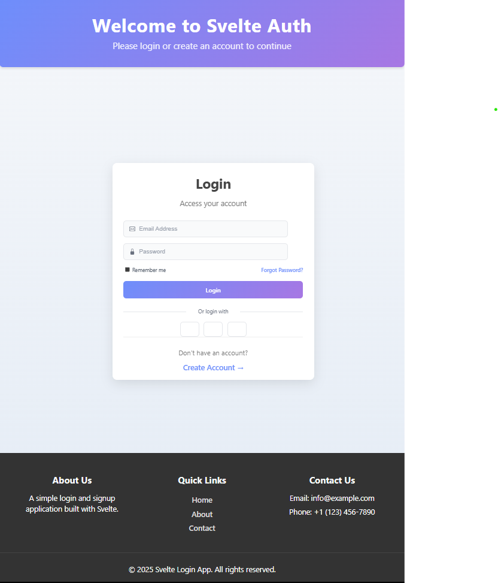

# Svelte Auth - Login & Signup Application


A visually appealing, single-page Svelte application featuring a 3D flip card animation for login and signup functionality.



## Features

- 📱 Responsive design that works on desktop and mobile devices
- 🔄 Smooth 3D flip card animation between login and signup forms
- 🎨 Modern UI with gradient colors and subtle animations
- 📝 Form validation for both login and signup
- 🔒 Password confirmation on signup
- ✅ Terms of service agreement checkbox
- 🌐 Social login options (Google, Facebook, Apple)
- 💾 "Remember me" functionality
- ⚡ Loading state indicators

## Project Structure

```
src/
├── app.css               # Global CSS styles
├── App.svelte            # Main application component with 3D flip card
├── main.js               # Entry point for the Svelte application
├── vite-env.d.ts         # TypeScript declarations for Vite
├── assets/               # Static assets (images, etc.)
├── components/           # Reusable UI components
│   ├── Footer.svelte     # Footer component with links and copyright
│   ├── Header.svelte     # Header component with title and subtitle
│   ├── Login.svelte      # Login form component
│   └── Signup.svelte     # Signup form component
└── lib/                  # Utility functions and shared code
```

## Components

### App.svelte

The main application component that:

- Imports and arranges all components
- Manages the state for flipping the card between login and signup
- Implements the 3D flip card animation
- Contains the layout structure for the single-page application

### Header.svelte

A customizable header component that:

- Displays the application title and subtitle
- Features a gradient background
- Accepts props for customizing the title and subtitle text

### Login.svelte

The login form component that:

- Handles email and password inputs
- Provides form validation
- Manages login submission state
- Offers "Remember me" functionality
- Includes "Forgot Password" link
- Provides social login options
- Displays error messages

### Signup.svelte

The signup form component that:

- Collects user information (name, email, password)
- Validates password confirmation
- Requires terms of service agreement
- Manages signup submission state
- Provides social signup options
- Displays error messages

### Footer.svelte

A responsive footer component that:

- Displays company information
- Includes quick navigation links
- Shows contact information
- Displays a copyright notice with the current year

## Getting Started

### Prerequisites

- Node.js 14.x or higher
- npm or yarn

### Installation

1. Clone the repository:

```bash
git clone <repository-url>
```

2. Navigate to the project directory:

```bash
cd login-signup_Svelte
```

3. Install dependencies:

```bash
npm install
# or
yarn install
```

4. Start the development server:

```bash
npm run dev
# or
yarn dev
```

5. Open your browser and navigate to `http://localhost:5173`

## Usage

- The application starts on the login screen
- Click "Create Account" to flip the card to the signup form
- On the signup form, click "Login" to flip back to the login form
- Fill in the required fields and submit the form to see the validation in action

## Customization

- Modify `app.css` to change global styles
- Edit component styles to customize the appearance
- Update the Header component props to change the title and subtitle
- Customize form fields and validation as needed

## License

This project is licensed under the MIT License - see the LICENSE file for details.

## Acknowledgments

- Built with [Svelte](https://svelte.dev/)
- Icons from [Bootstrap Icons](https://icons.getbootstrap.com/)
- Inspired by modern authentication UI designs
